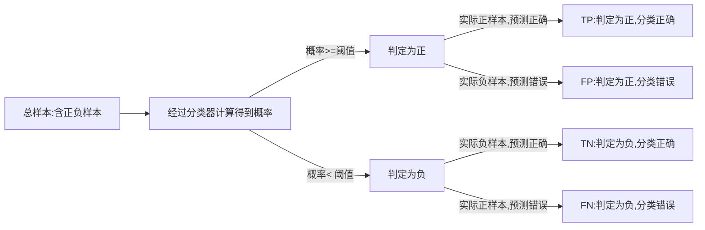

### 1. 离线评估

#### （1）介绍

离线评估是最常用、最基本的。顾名思义就是：我们将模型部署于线上环境之前，在离线环境下进行的评估。由于不用部署到生产环境，“离线评估”没有线上部署的工程风险，也不会浪费宝贵的线上流量资源，而且具有测试时间短，可多组并行，以及能够利用丰富的线下计算资源等诸多优点。

#### （2）评估方法

##### ① Holdout 检验。

最基础，最常用的离线评估方法，它将原始的样本集合随机划分为**训练集**和**测试集**两部分，所以 Holdout 检验的关键词就是“随机”。

缺点：评估的结果有一定随机性。且样本比较少时，训练集会进一步减小，往往会影响模型的训练效果。

##### ② 交叉检验

将全部样本划分成 k 个大小相等的样本子集，然后依次遍历这 k 个子集，每次把当前遍历到的子集作为验证集，其余所有的子集作为训练集，这样依次进行 k 次模型的训练和评估。最后，我们再将所有 k 次评估指标的平均值作为最终的评估指标。在我们的实践中，k 经常取 10，也就是依次进行 10 次检验然后取指标均值。

缺点：当样本规模比较小时，将样本集进行划分会让训练集进一步减小，这往往会影响模型的训练效果。

##### ③ 自助法（不太常用）

**基于自助采样的检验方法**，它的主要过程是：对于总数为 n 的样本集合，我们先进行 n 次有放回地随机抽样，得到大小为 n 的训练集。在 n 次采样过程中，有的样本会被重复采样，有的样本没有被抽出过，我们再将这些没有被抽出的样本作为验证集进行模型验证，这就是自助法的验证过程。

缺点：改变了原有数据的分布，有可能让模型产生一定程度的偏差。

##### ④ 时间切割

防止“信息穿越”导致的模型作弊现象发生，我们一般会使用时间切割的方案去划分训练集和测试集。比如，你一共处理了 30 天的样本，从第 25 天末开始切割，前 25 天的样本作为训练集，后 5 天的样本作为测试集，这样我们就从根源上切断了引入“未来信息”的可能。

缺点：整个评估过程是静态的，模型不会随着评估的进行而更新，这显然是不符合事实的

##### ⑤ 离线Replay

在离线状态下对线上更新过程进行仿真，让整个评估过程“动”起来。业界把这样离线仿真式的评估方式叫做离线 Replay。

Replay 评估的过程更接近于真实的线上环境，因为它在线下还原了模型在线上的更新、预估过程。这也让 Replay 方法的评估结果更加权威可信，毕竟，我们最终的目标是让模型在线上产生更好的效果。

#### （3）总结

#### （4）经典问答

① 离线 Replay 和增强学习有什么相似之处吗？它们两个还有什么更深层次的关系吗？
* 离线Replay和RL都是动态更新模型的，都需要不断的测试和再训练模型。增强学习(如DRN)是通过不断接受反馈，在线更新模型的，所以评估方法不能引入未来信息，
* 简单的时间切割评估方法又不能模拟模型的更新频率，所以离线Replay是增强学习的唯一离线评估方法。

### 2. 评估指标

为了更明白的描述各个指标，预定义如下标识：

关于以上TP、FP、FN、TN四组表示，大家应该可以总结出规律，其中第一个字母的**T和F**分别表示分类结果**正确和错误**；第二个字母P和N分别表示判定为**正和负样本**。

#### （1）低阶评估指标

对于低阶评估指标来说，准确率、精确率与召回率、对数损失、均方根误差，这四个指标在推荐模型评估中最常用。

##### ① 准确率：

$$
准确率 = \frac{(TP + TN)_{分类结果正确的样本(圆形图中绿色对角块)}}{(TP + FP + FN + TN)_{总样本}} * 100 \%
$$

缺点：当不同类别的样本比例非常不均衡的时候，占比大的类别往往成为影响准确率的最主要因素。比如，负样本占 99%，那么分类器把所有样本都预测为负样本也可以获得 99% 的准确率。

##### ② 精确率与召回率：

$$
精确率 = \frac{TP_{分类结果正确的正样本(圆形图中左上角)}}{(TP + FP)_{分类为正的样本(圆形图中的左半球，纵轴方向)}} * 100\%
$$

$$
召回率=\frac{TP_{分类结果正确的正样本(圆形图中左上角)}}{(TP + FN)_{真实的正样本(圆形图中的北半球，横轴方向)}} * 100 \%
$$

* 在推荐列表中，通常没有一个确定的阈值来把预测结果直接判定为正样本或负样本，而是采用 **Top N 排序结果的精确率（Precision@N）和召回率（Recall@N）**来衡量排序模型的性能。具体操作，就是认为模型排序的前 N 个结果就是模型判定的正样本，然后分别计算 Precision@N 和 Recall@N。

* 精确率和召回率其实是矛盾统一的一对指标，可以使用**F1-score**综合地反映精确率和召回率的高低。 F1-score的定义是精确率和召回率的**调和平均值**。

  $$
  F1=\frac{2 · Precision · Recall}{Precision + Recall}
  $$

##### ③ 对数损失

二分类和多分类模型的 Logloss 其实就是我们之前讲过的逻辑回归和 Softmax 模型的损失函数，而大量深度学习模型的输出层正是逻辑回归或 Softmax，因此，采用 Logloss 作为评估指标能够非常直观地反映模型损失函数的变化。所以在训练模型的过程中，我们在每一轮训练中都会输出 Logloss，来观察模型的收敛情况。

二分类对数损失函数：$-\frac{1}{N} \sum^N_{i=1} [y_i log{p_i} + (1-y_i) log(1-p_i)]$

多分类对数损失函数：$-\frac{1}{N} \sum^N_{i=1} \sum^M_{j=1} [y_{i,j} \ log(p_{i,j})]$

##### ④ 均方根误差

准确率、精确率、召回率、LogLoss 都是针对分类模型指定的指标。除了这种分类模型外，还有回归模型。它是用来预测一个连续值，比如预测某个用户对某个电影会打多少分，这就是一个回归模型。最常用的评估指标就是**均方根误差（RMSE，Root Mean Square Error）**。公式如下：

$$
RMSE=\sqrt \frac{\sum^N_{i=1} (y_i - \hat{y_i})^2}{N}
$$
$y_i$是第$i$个样本点的真实值，$\hat{y_i}$是第$i$个样本点的预测值，$n$是样本个数。那么均方根误差越小，当然就证明这个回归模型预测越精确。

#### （2）高阶评估指标

##### ① P-R曲线：P: 精确率Precision，R: 召回率Recall。

为了综合评价一个推荐模型的好坏，不仅要看模型在一个 Top n 值下的精确率和召回率，还要看到模型在不同 N 取值下的表现，甚至最好能绘制出一条 n 从 1 到 N，准确率和召回率变化的曲线，这条曲线就是 P-R 曲线。其中**纵轴**是精确率(注意看公式2的分母)，**横轴**是召回率(注意看公式3的分母)。

AUC(Area Under Curve)，曲线下面积。计算 AUC 值只需要沿着曲线横轴做积分。AUC 越大，就证明推荐模型的综合性能越好。其中可以是P-R曲线，也可以是接下来要介绍的ROC曲线。

##### ② ROC曲线：the Receiver Operating Characteristic 曲线（受试者工作特征曲线）。

**纵轴**是真阳性率**TPR**（True Positive Rate）:
$$
TPR=\frac{TP_{分类正确的正样本(圆形图中左上角)}}{(TP + FN)_{真实的正样本(圆形图中北半球)}} = R_{召回率}
$$
**横轴**是假阳性率**FPR**（False Positive Rate）:
$$
FPR=\frac{FP_{分类错误的负样本(圆形图中左下角)}}{(FP+TN)_{真实的负样本(圆形图中南半球)}}
$$
绘制过程：

* 第一步，根据样本标签统计出正负样本的数量，假设正样本数量为P(圆形图中北半球)，负样本数量为N(圆形图中南半球)。
* 第二步，把纵轴的刻度间隔设置为1/P，横轴的刻度间隔设置为1/N。
* 第三步，再根据模型输出的预测概率对样本进行从高到低的排序。
* 第四步，依次遍历样本。从零点开始绘制 ROC 曲线，每遇到一个正样本就沿纵轴方向绘制一个刻度间隔的曲线，每遇到一个负样本就沿横轴方向绘制一个刻度间隔的曲线，直到遍历完所有样本，曲线最终停在 (1,1) 这个点，整个 ROC 曲线就绘制完成了。
* 第五步：在绘制完 ROC 曲线后，我们也可以像 P-R 曲线一样，计算出 ROC 曲线的 AUC，AUC 越高，推荐模型的综合性能就越好。

##### ③ 平均精度均值：mAP（mean average precision）

mAP是对平均精度（AP，average precision）的再次平均。那么如何计算AP呢？假设推荐系统对某一用户测试集的排序结果如下（就是给这用户推荐了N个物品，用户实际点击的统计）：

| 推荐序列 | N=1  | N=2  | N=3  | N=4  | N=5  | N=6  |
| -------- | ---- | ---- | ---- | ---- | ---- | ---- |
| 真实标签 | 1    | 0    | 0    | 1    | 1    | 1    |

其中1表示正样本，0表示负样本（也就是说系统给这名用户推荐了N=6个物品，他/她分别点击了第1、4、5、6共计4个物品）。则每个位置上的Precision@N分别是多少呢？结果如下：

| 推荐序列    | N=1  | N=2  | N=3  | N=4  | N=5  | N=6  |
| ----------- | ---- | ---- | ---- | ---- | ---- | ---- |
| 真实标签    | 1    | 0    | 0    | 1    | 1    | 1    |
| Precision@N | 1/1  | 1/2  | 1/3  | 2/4  | 3/5  | 4/6  |

计算时候，只取正样本处的 Precision 进行平均，所以$AP = \frac {(1/1 + 2/4 + 3/5 + 4/6)} {4} = 0.6917$。

mAP又是什么呢？对测试集中的每个用户都进行样本排序，那么每个用户都会计算出一个 AP 值，再对所有用户的 AP 值进行平均，就得到了 mAP。**因为 mAP 需要对每个用户的样本进行分用户排序，而 P-R 曲线和 ROC 曲线均是对全量测试样本进行排序。**

#### （3）问答经典

##### ① 在正负样本不平衡的场景下，P-R和ROC哪个稳定？

当我们将负样本复制10倍时：

* ROC曲线（$TPR=\frac{TP_{分类正确的正样本(圆形图中左上角)}}{(TP + FN)_{真实的正样本(圆形图中北半球)}}$，$FPR=\frac{FP_{分类错误的负样本(圆形图中左下角)}}{(FP+TN)_{真实的负样本(圆形图中南半球)}}$）中，TPR显然不会变，FPR是负样本中被预测为正样本的比例，这其实也是不变的，那整个ROC曲线也就没有变。
* PR曲线($精确率 = \frac{TP_{分类结果正确的正样本(圆形图中左上角)}}{(TP + FP)_{分类为正的样本(圆形图中的左半球，纵轴方向)}}$，$召回率=\frac{TP_{分类结果正确的正样本(圆形图中左上角)}}{(TP + FN)_{真实的正样本(圆形图中的北半球，横轴方向)}}$），TP不变，FP增大，而召回率R没有变，显然ROC曲线更稳定一些。

##### ② 动图显示表现优秀、表现一般、表现很差的三种分类器对应的PR曲线和ROC曲线。

以下动图参考自：《[P-R曲线和ROC曲线理解](https://zhuanlan.zhihu.com/p/92218196)》，正样本对应下图中的红色曲线(病人分布)，负样本对应下图中的蓝色曲线(健康人群分布)

* 表现优秀的分类器，其中正负样本分布基本不重合，因此分类器可以很好地判定，此时PR和ROC曲线下的面积都很大。

  

* 表现很差的分类器，其中正负样本分布全部重合，因此分类器无法正确判定，此时PR和ROC曲线下面积都很小。

  

* 表现一般的分类器，其中正负样本重合一小部分，因此分类器在非重合场景下能够正确判定，重合场景下错误率较高。

  

### 3. 在线A/B测试

#### （1）A/B测试原理

A/B 测试又被称为“分流测试”或“分桶测试”，它通过把被测对象随机分成 A、B 两组，分别对它们进行对照测试的方法得出实验结论。具体到推荐模型测试的场景下，它的流程是这样的：

先将用户随机分成实验组和对照组，然后给实验组的用户施以新模型，给对照组的用户施以旧模型，再经过一定时间的测试后，计算出实验组和对照组各项线上评估指标，来比较新旧模型的效果差异，最后挑选出效果更好的推荐模型。

#### （2）选择A/B测试的原因

① **离线评估无法完全还原线上的工程环境**。一般来讲，离线评估往往不考虑线上环境的延迟、数据丢失、标签数据缺失等情况，或者说很难还原线上环境的这些细节。因此，离线评估环境只能说是理想状态下的工程环境，得出的评估结果存在一定的失真现象。

② **线上系统的某些商业指标在离线评估中无法计算**。 离线评估一般是针对模型本身进行评估的，无法直接获得与模型相关的其他指标，特别是商业指标。像我们上节课讲的，离线评估关注的往往是ROC曲线、PR曲线的改进，而线上评估却可以全面了解推荐模型带来的用户点击率、留存时长、PV访问量这些指标的变化。

③ **离线评估无法完全消除数据有偏（Data Bias）现象的影响**。 什么叫“数据有偏”呢？因为离线数据都是系统利用当前算法生成的数据，因此这些数据本身就不是完全客观中立的，它是用户在当前模型下的反馈。所以说，用户本身有可能已经被当前的模型“带跑偏了”，你再用这些有偏的数据来衡量你的新模型，得到的结果就可能不客观。

#### （3）A/B测试核心原则

① 怎样才能对用户进行一个公平公正的分桶呢？如果有多组实验在同时做 A/B 测试，怎样做才能让它们互不干扰？

* 分桶：我们需要注意的是**样本的独立性和分桶过程的无偏性**。这里的“独立性”指的是同一个用户在测试的全程只能被分到同一个桶中。“无偏性”指的是在分桶过程中用户被分到哪个实验桶中应该是一个纯随机的过程。
* 分层：**层与层之间的流量“正交”，同层之间的流量“互斥”**。

② 层与层之间的流量“正交”：**层与层之间的独立实验的流量是正交的，一批实验用的流量穿越每层实验时，都会再次随机打散，然后再用于下一层的实验。**看下示意图：

假设，在一个 X 层的实验中，流量被随机平均分为 X1（蓝色）和 X2（白色）两部分。当它们穿越到 Y 层的实验之后，X1 和 X2 的流量会被随机且均匀地分配给 Y 层的两个桶 Y1 和 Y2。

如果 Y1 和 Y2 的 X 层流量分配不均匀，那么 Y 层的样本就是有偏的，Y 层的实验结果就会被 X 层的实验影响，也就无法客观地反映 Y 层实验组和对照组变量的影响。

③ 同层之间的流量“互斥”：

* 如果同层之间进行多组 A/B 测试，不同测试之间的流量不可以重叠，这是第一个“互斥”；
* 一组 A/B 测试中实验组和对照组的流量是不重叠的，这是第二个“互斥”。

不同测试之间以及A/B测试的实验组和对照组之间的用户是不重叠的。特别是对推荐系统来说，用户体验的一致性是非常重要的。也就是说我们不可以让同一个用户在不同的实验组之间来回“跳跃”，这样会严重损害用户的实际体验，也会让不同组的实验结果相互影响。因此在 A/B 测试中，保证同一用户始终分配到同一个组是非常有必要的。

#### （4）A/B测试评估指标

**A/B 测试的指标应该与线上业务的核心指标保持一致。**

### 4. 推荐系统评估体系

#### （1）什么是推荐系统评估体系

由多种不同的评估方式组成的、兼顾效率和正确性的，一套用于评估推荐系统的解决方案。典型评估体系示意图如下：

处于最底层的是传统的离线评估方法，比如 Holdout 检验、交叉检验等，往上是离线 Replay 评估方法，再往上是一种叫 Interleaving 的线上测试方法，最后是线上 A/B 测试。

越是底层的方法就会承担越多筛选掉改进思路的任务，这时候“评估效率”就成了更关键的考虑因素；

随着候选模型被一层层筛选出来，越接近正式上线的阶段，评估方法对评估“正确性”的要求就越严格。

#### （2）实例讲解模型筛选过程

假设，现在有 30 个待筛选的模型，如果所有模型都直接进入线上 A/B 测试的阶段进行测试，所需的测试样本是海量的，由于线上流量有限，测试的时间会非常长。但如果我们把测试分成两个阶段，第一个阶段先进行初筛，把 30 个模型筛选出可能胜出的 5 个，再只对这 5 个模型做线上 A/B 测试，所需的测试流量规模和测试时间长度都会大大减少。这里的初筛方法，就是我们在评估体系中提到的**离线评估**、**离线 Replay** 和**在线 Interleaving** 等方法。

#### （3）Netflix 的 Replay 评估方法实践

Netflix 为了进行离线 Replay 的实验，建立了一整套从**数据生成**到**数据处理**再到**数据存储**的数据处理架构，并给它起了一个很漂亮的名字，叫做时光机（Time Machine）。

上图是时光机的架构，图中最主要的就是 **Snapshot Jobs（数据快照）**模块。它是一个每天执行的 Spark 程序，它做的主要任务就是**把当天的各类日志、特征、数据整合起来**，形成当天的、供模型训练和评估使用的样本数据。它还会以日期为目录名称，将样本快照数据保存在分布式文件系统 S3 中（Snapshots），再对外统一提供 API（Batch APIs），供其他模型在训练和评估的时候按照时间范围方便地获取。

Snapshot Jobs 主任务的源数据是它上方的 **Context Set 模块**和左边的 **Prana 模块**。

**Context Set 模块**负责保存**所有的历史当天的环境信息**。 环境信息主要包括两类：一类是存储在 Hive 中的场景信息，比如用户的资料、设备信息、物品信息等数据；另一类是每天都会发生改变的一些统计类信息，包括物品的曝光量、点击量、播放时长等信息。

**Prana 模块**负责处理**每天的系统日志流**。 系统日志流指的是系统实时产生的日志，它包括用户的观看历史（Viewing History）、用户的推荐列表（My List）和用户的评价（Ratings）等。这些日志从各自的服务（Service）中产生，由 Netflix 的统一数据接口 Prana 对外提供服务。

Snapshot Jobs 这个核心模块每天的任务就是，通过 Context Set 获取场景信息，通过 Prana 获取日志信息，再经过整合处理、生成特征之后，保存当天的数据快照到 S3。

在生成每天的数据快照后，使用 Replay 方法进行离线评估就不再是一件困难的事情了，因为我们没有必要在 Replay 过程中进行烦琐的特征计算，直接使用当天的数据快照就可以了。

#### （4）Interleaving 评估方法

① **意义**：首先，它是和 A/B 测试一样的在线评估方法，能够得到在线评估指标；其次，它提出的目的是为了比传统的 A/B 测试用更少的资源，更快的速度得到在线评估的结果。

② **传统A/B过程**：把用户随机分成两组。一组接受当前的推荐模型 A 的推荐结果，这一组被称为对照组 。另一组接受新的推荐模型 B 的推荐结果，这组被成为实验组。

③ **Interleaving过程**：**只需要一组用户**，这些用户会收到模型 A 和模型 B 的混合结果。也就是说，用户会在一个推荐列表里同时看到模型 A 和模型 B 的推荐结果。在评估的过程中，Interleaving 方法通过分别累加模型 A 和模型 B 推荐物品的效果，来得到模型 A 和 B 最终的评估结果。

④ **两者形象化的比较：**

⑤ 以相等的概率让模型 A 和模型 B 产生的物品交替领先。这就像在野球场打球的时候，两个队长会先通过扔硬币的方式决定谁先选人，再交替来选择队员。

⑥ 最后，我们要清楚推荐列表中的物品到底是由模型 A 生成的，还是由模型 B 生成的，然后统计出所有模型 A 物品的综合效果，以及模型 B 物品的综合效果，然后进行对比。这样，模型评估过程就完成了。

⑦ 在测试一些用户级别而不是模型级别的在线指标时，我们就不能用 Interleaving 方法。比如用户的留存率，用户从试用到付费的转化率等，由于 Interleaving 方法同时使用了对照模型和实验模型的结果，我们就不清楚到底是哪个模型对这些结果产生了贡献。但是在测试 CTR、播放量、播放时长这些指标时，Interleaving 就可以通过累加物品效果得到它们。这个时候，它就能很好地替代传统的 A/B 测试了。

#### （5）Interleaving方法的优点与缺点

优点：

① Interleaving方法的**灵敏度高**于A/B测试。Netflix的实验表明，Interleaving方法利用$10^3$个样本就能判定算法A是否好于算法B，但是A/B测试则需要$10^5$个样本。

② Netflix的实验同时表明Interleaving方法的指标与A/B测试指标之间的**相关性是非常强的**，也就意味着在Interleaving方法中胜出的算法也极有可能在A/B测试中胜出。

缺点：

① Interleaving的**工程实现框架比A/B测试复杂**，因为Interleaving方法的实验逻辑和业务逻辑耦合在一起，还需要将大量辅助性数据标识添加到整个数据流中。

② Interleaving方法只是对“用户对算法推荐结果偏好程度”的相对测量，**不能得出一个算法真实的表现**。比如要想知道算法A能够将用户整体的观看时长提高多少？留存率提高多少？这些都是无法用Interleaving方法得到的。**因此通常用的方法就是Interleaving+A/B测试两阶段实验结构**。

### 参考资料

《深度学习推荐系统实战》 -- 极客时间，王喆

《[P-R曲线和ROC曲线理解](https://zhuanlan.zhihu.com/p/92218196)》  -- 知乎

