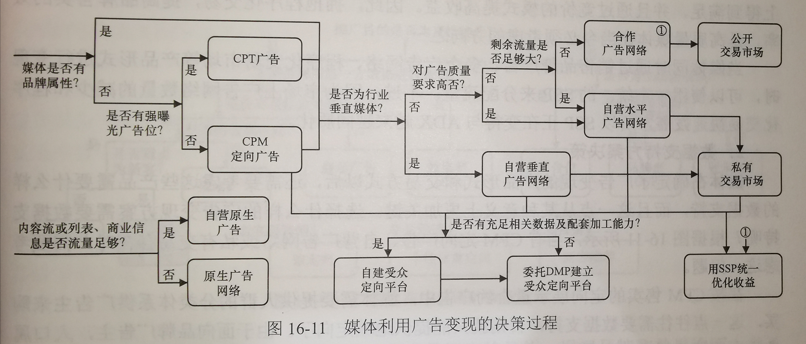
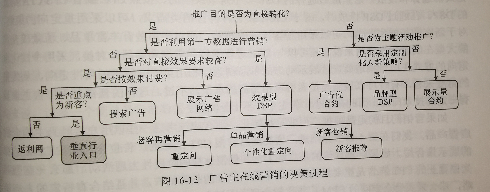
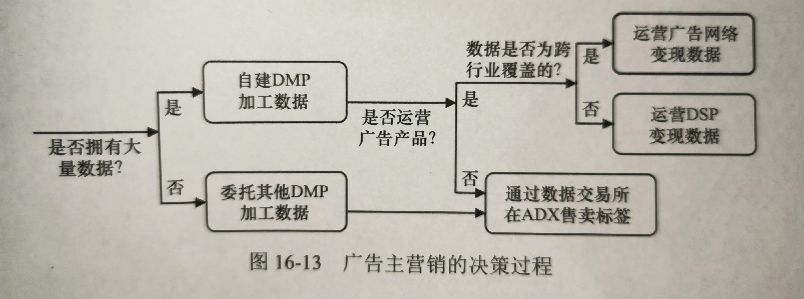

## 创意优化

### 创意需要将向用户推送广告的关键原因明确表达出来

### 程序化创意

- 地域性创意
- 搜索重定向创意
- 个性化重定向创意

### 电机热力图

- 电机热力图是将某一个创意各位置被点击的密度用热力图方式呈现，帮助创意优化者直观的发现和解决其中的问题

### 创意的发展趋势

- 视频化

	- 激励视频形式

- 交互化

## 实验框架

### 一个实用的实验框架需要尽可能的同时容纳多组试验，以提高流量利用效率和产品进化速度

### 设计实验系统的关键是利用系统模块之间的相对独立性，用分层的结构来扩展实验流量

## 广告监测与归因

### 广告监测

- 主要需求存在于按CPT或CPM结算的合约广告，需要委托第三方监测公司对实际发生的展示或点击数目进行核对

### 广告安全

- 广告投放验证：重点在于阻止不恰当展示的发生
- 可视性验证：重点在于广告展示的曝光程度

### 广告归因

- 按CPS/CPA/ROI方式结算的广告，转化行为不发生在媒体上，往往需要第三方机构对这些效果数据进行追踪，确定某次转化来自哪个渠道，将广告展示和点击数据对应起来
- 常见方法

	- 直接访问归因
	- 用户ID碰撞归因

## 作弊与反作弊

### 广告作弊：制造虚假流量，或用技术手段骗过广告监测和归因

### 作弊方法分类

- 从主体来看，分媒体作弊、广告平台作弊、广告主竞争对手作弊
- 从原理看，分为虚假流量作弊、归因作弊
- 从作弊手段看，分机器作弊、人工作弊

### 常见作弊方法

- 服务器刷监测代码
- 客户端刷监测代码
- 频繁换用户身份
- 流量劫持

	- 损害媒体利益，但是有真是流量

		- 信道弹窗
		- 创意替换
		- 搜索结果重定向

	- 损害广告主利益

		- 落地页来源劫持

- cookie填充
- IP遮盖
- 点击滥用与点击注入

## 产品技术选型实战

### 媒体实战

### 广告主实战

### 数据提供方实战

