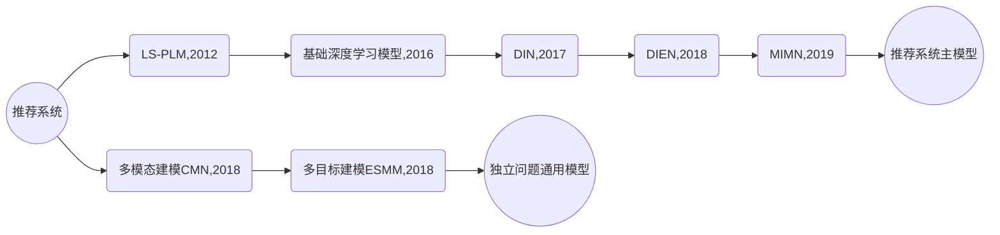

### 1. Facebook的深度学习推荐系统

2014年，Facebook发表了广告推荐系统论文GBDT+LR。严格意义上讲，这并不属于深度学习的范畴，但在当时，这种方式进行特征的自动组合和筛选，开启了特征工程模型化、自动化的新阶段。并且其在2014年就采用的在线学习、在线数据整合、负样本降采样等技术至今仍具有极强的工程意义。

2019年Facebook又发布了最新的深度学习模型DLRM（[Deep Learning Recommender Model](https://arxiv.org/abs/1906.00091)），采用经典的深度学习模型架构，基于CPU+GPU平台完成模型训练，是业界经典的深度学习推荐系统尝试。

#### （1）应用

Facebook的广告推荐系统是一个标准的CTR预估场景，输入用户（User）、广告（Ad）、上下文（Context）相关特征，预测CTR，然后再使用CTR进行广告排序和推荐。

由于Facebook其他模块需要利用CTR计算广告出价、投资回报率（ROI）等预估值，因此CTR模型的预估值应该是一个具有物理意义的精准的CTR，而不是仅仅输出一个广告排序。同时Facebook也介绍了输出值与实际值的CTR矫正的方法。

#### （2）GBDT+LR预估模型

参考本系列的相关笔记-《[08-传统推荐算法发展汇总](https://notlate.net/posts/d6641ee8.html#5-gbdtlr)》

##### ①实时数据流架构

为了实现模型的准实时训练和特征的准实时更新，Facebook在上述论文中提出了其基于Scribe（由Facebook开发并开源的日志收集系统）构建的实时数据流架构，被称为Online Data Joiner（在线数据整合）模块，该模块与其他模块的关系图如下：

Online Data Joiner模块最重要的作用是：准实时的把来自不同数据流的数据整合起来，形成训练样本，并最终与点击数据（标签）进行整合，形成完整的有标签样本。在整个过程中，需要注意的点如下：

**Waiting window（数据等待窗口）的设定**

waiting window就是在物品曝光后，要等多久才能够判定这个曝光行为产生了点击。如果窗口过大，则数据实时性受影响；如果过小，则会有一部分点击数据统计不全。这个设置是需要工程不断调优找到最佳的，少量点击数据丢失也是不可避免的。

**分布式架构与全局统一的Action ID（行为ID）**

为了实现分布式架构下曝光记录与点击记录的整合，Facebook除了为每个行为建立全局统一的Request ID，还建立了HashQueue用于缓存曝光记录。在缓存队列中的曝光记录，如果在Waiting Window过期后还没有匹配到点击记录，就会被作为负样本。

**数据流保护机制**

论文中，Facebook专门提到了Online Data Joiner的保护机制，因为该模块若因为某些异常而失效，比如点击数据流由于Action ID的bug无法与曝光数据流进行正确联结，那么所有的样本都会认定为负样本。同时，由于模型采用实时训练和服务，所以模型准确度会很快受到影响，后果非常严重。保护机制则是专门设立异常检测机制，**一旦发现实时样本流的数据分布发生变化**，会立即切断在线学习的过程，防止线上问题发生。

##### ② 降采样

为了控制数据规模，降低训练开销，Facebook时间了两种降采样方法：Uniform subsampling（均匀采样）和Negative down sampling（负样本降采样）。均匀采样是对所有样本进行无差别的随机抽样，其试验了1%、10%、50%、100%四个采样频率，从下图可以看出，当采样频率为10%的时候，相比全量数据训练的模型，模型损失仅仅上升了1%，因此是一个比较合适的平衡工程和理论最优的选择。

负采样方法则是保留全量正样本，对负样本进行降采样。除了提高训练效率，负样本还直接解决了正负样本不平衡的问题，Facebook经验性的选择了从0.0001到0.1的福采样频率，效果图如下：

可以看到当负采样频率为0.025时，模型损失最小，甚至小于0.1的频率，论文中未给出解释。在实际应用中，Facebook采用了0.025的负采样频率。

##### ③ 模型矫正

负采样带来的问题是CTR预估值得漂移：假设真实CTR是0.1%，进行0.01的负采样之后，CTR会攀升到10%左右。前文也提到了，Facebook的业务背景要求其计算出的CTR需要是具有物理意义的精准的CTR，为了进行准确的竞价和ROI估计，进行负采样后的CTR需要矫正，公式如下：
$$
q = \frac{p}{p + (1-p) / w}
$$
其中$q$是校正后的CTR，$p$是模型预估的CTR，$w$是负采样频率。

##### ④ 工程实践

* 特征工程模型化
* 模型复杂性和实效性的权衡
* 用数据验证Idea

#### （3）DLRM预估模型

DLRM是一次彻底的应用深度学习方法的尝试。

##### ① 模型结构

如果所示，各层作用如下：

**特征工程**：所有的特征分为两类：一类是将类别、id类特征用one-hot编码生成稀疏特征（sparse features）；另外一类是数值型的连续特征（dense features）。

**Embedding层**：把稀疏特征转换成$n$维Embedding向量；连续性特征连接成一个特征向量之后输入黄色的MLP，被转换成同样$n$维向量。

**神经网络层(NNs)**：Embedding层上边的三角形，$n$维的Embedding向量有可能进一步通过神经网络层处理，但是这个过程是选择性的，根据实际场景评估决定的。

**特征交互层(Interactions)**：把之前的Embedding向量两两做内积操作，再和连续型特征对应的特征向量连接，输入后续MLP。目的是让特征之间做充分的交叉组合之后，再进入MLP做最终的目标拟合。

**目标拟合层**：最上层的三角形，表示一个全连接的MLP，最后一层使用softmax函数输出点击率。

综上分析，模型结构并不复杂，也没有注意力机制、序列模型、强化学习等思想，是一个非常标准的工业界深度学习推荐模型。简单的模型结构在海量的数据背景下也可以发挥出不俗的作用。

##### ② 并行训练方法

由于Facebook的数据量非常大，模型训练必然要并行化。DLRM融合使用了模型并行和数据并行的方案：

对Embedding部分采用了模型并行，可以减轻内存瓶颈问题。在一个设备上仅保存一部分Embedding层参数，每个设备进行并行mini batch梯度更新，仅更新自己节点上的部分Embedding参数。

对MLP部分（两个NNs层）采用了数据并行，可以并行前向和反向传播。每个设备已有全部模型参数，利用部分数据计算梯度，再利用全量规约（AllReduce）的方法汇总所有梯度进行参数更新。

#### （4）总结

无论是GBDT+LR还是DLRM，Facebook的技术选择总是偏工业化，简单直接，以解决问题为主。虽然从学术角度看模型创新性不足，但从业者可以从中借鉴到非常多的工程实践经验。如果公司刚开始从传统机器学习模型转到深度学习模型，则完全可以采用DLRM作为标准实现。

### 2. Airbnb基于Embedding的实时搜索推荐系统

2018年KDD的最佳论文《[Real-time Personalization using Embeddings for Search Ranking at Airbnb](https://raw.githubusercontent.com/murufeng/awesome-papers/master/Embedding/%5BAirbnb%20Embedding%5D%20Real-time%20Personalization%20using%20Embeddings%20for%20Search%20Ranking%20at%20Airbnb%20(Airbnb%202018).pdf)》介绍了Airbnb把Embedding技术应用于搜索推荐的实践。

Embedding技术两大作用：1）将稀疏特征转换成稠密特征；2）能够对物品语义特征进行编码，通过计算相似度进行相似物品搜索。

#### （1）应用场景

Airbnb是一家短租网站，提供房主和短租客的中介平台。租客输入地点、价位、关键词等信息后，Airbnb给出房源的搜索推荐列表。对于列表，有以下集中交互方式：

* 租客点击（Click）房源
* 租客立即预定（Instant Book）房源
* 租客发出预定请求（Booking Request），房主有可能拒绝（Reject）、同意（Accept）或者不响应（No Response）租客的预定请求。

针对以上交互数据，Airbnb构建了实时搜索排序模型。为了捕捉用户兴趣，Airbnb**没有**将用户历史数据中的**点击房源id序列**（clicked listing ids）或者**预定房源id序列**（booked listing ids）直接输入排序模型，而是先对*租客*和*房源***分别进行Embedding**，利用Embedding结果构建出诸多特征，作为排序模型的输入。

Airbnb分别对用户的“短期”和“长期”兴趣进行编码，生成了两种Embedding。**短期兴趣目的**是进行房源的相似推荐和session（会话）内的实时个性化推荐。**长期兴趣目的**是在最终的推荐结果中照顾到用户之前的预定偏好，推荐更容易被用户预订的个性化房源。

#### （2）基于短期兴趣的房源Embedding方法

Airbnb利用session内点击数据对房源进行Embedding，捕捉用户在一次搜索过程中的短期兴趣。那session内点击数据怎么获取呢？就是用户在一次搜索过程中点击的房源序列，这个序列需要满足2个条件：1）只有在房源详情页停留超过30秒才算序列中的一个数据点；2）如果用户超过30分钟没有动作，那么序列结束。

获取到由点击房源组成的序列后，就可以用Item2vec方法，把这些序列当成“句子”一样的样本，进行Embedding训练。Airbnb使用的是Word2vec的跳词（Skip-gram）模型，修改目标函数拟合Airbnb的业务目标。修改点如下：

① 在原始目标函数基础上，针对Airbnb的业务特点，希望把预定信息引入Embedding，目的是使得Airbnb的搜索列表和相似列表更倾向于推荐之前预定成功的Session中的房源。基于此想法，Airbnb把会话点击序列分成两类：1）最终产生预定行为的称为预定会话，会话只有最后一个房源是被预订房源；2）否则称为探索性会话。为了把预定行为引入目标函数，强假设这个被预定房源与滑动窗口的中心房源相关。

② 为了更好的发现同一市场内部房源的差异性，Airbnb加入了另外一组负样本，在同一市场的房源集合中随机抽样，获得一组新的负样本，并加入目标函数。

训练过程：使用负采样方法。

冷启动方案：如果有新的房源确实Embedding向量，就找附近的3个同样类型、相似价格的房源向量进行平均得到。

#### （3）基于长期兴趣的用户Embedding和房源Embedding

基于短期兴趣的Embedding没有包含用户的长期兴趣信息。为了解决这种问题，Airbnb使用了预定会话序列。假设用户$j$在过去1年依次预定过5个房源，那么预定会话就是$s_j = (l_{j1}, l_{j2}, l_{j3}, l_{j4}, l_{j5})$。但是却不能和点击会话一样直接进行训练，因为这类预定数据是非常稀疏的，原因如下：

① 预定行为的总体数量本身远远小于点击行为

② 单一用户的预定行为很少，大量用户在过去1年甚至只预定过1个房源，导致很多预定会话序列长度仅仅为1

③ 大部分房源被预定的次数也很少，Word2vec训练需要物品至少出现5~10次，但是大量房源被预定的次数少于5词，根本无法训练出有效的Embedding。

Airbnb的解决方案是：**基于某些属性规则做相似用户和相似房源的聚合**。

首先定义用户和房源的各种属性，比如用户属性有设备类型、是否填写简介、是否有头像照片、历史订阅次数等；房源属性有国家、类型、价格等。根据这些属性就可以用聚合数据的方式生成新的预定序列（booking session sequence）。直接用用户属性代替原来的user id，生成一个由所有该用户属性预定历史组成的预定序列。

得到用户属性的预定序列后，如何得到用户属性和房源属性的Embedding呢？为了让user type Embedding和listing type Embedding在同一个向量空间中生成，Airbnb采用的方式如下：

对于某一user id按时间排序的booking session($l_1, l_2,...,l_m$)，用（user_type, listing_type）组成的元组替换原来的listing item，原序列就变成了$((u_{type1}, l_{type1}), (u_{type2}, l_{type2}), ..., (u_{typeM}, l_{typeM}))$，这里的$l_{type1}$指的是房源$l_1$对应的房源属性，$u_{type1}$指的是该用户在预订房源$l_1$时的用户属性，用于用户的user_type会随着时间变化，所以$u_{type1}$和$u_{type2}$也不一定相同。

那如何训练呢？由于序列是元组组成的，如何确定“中心词（central item）”呢？Airbnb在论文中没有描述技术细节，《深度学习推荐系统》一书中给出了最接近论文原文的训练方式。

Airbnb分别给出了训练user type Embedding和listing type Embedding时，滑动窗口内“中心词”分别是user type($u_t$)和listing type($l_t$)时的目标函数如下：

其中$D_{book}$是中心词附近的用户属性和房源属性的集合，所以在训练过程中，用户属性和房源属性完全是被同等对待的，这两个目标函数也是完全一样的。可以认为训练时就是把元组扁平化了，把用户属性和房源属性当做完全相同的词去训练Embedding，这种方式自然保证了二者在同一个向量空间中生成。

#### （4）搜索词的Embedding

Airbnb还在其搜索推荐系统中对搜索词进行了Embedding，方法与用户Embedding类似，把搜索词和房源置于同一向量空间进行Embedding，再通过二者之间的余弦相似度进行排序。

#### （5）实时搜索排序模型和特征工程

Airbnb没有直接把Embedding相似度排名当做搜索结果，而是基于Embedding得到了不同的用户房源相关特征（user-listing pair feature），然后输入搜索排序模型，得到最终的排序结果。Airbnb基于Embedding生成了如下特征：

最后一项UserTypeListingTypeSim指的是用户属性和房源属性的相似度，这一项特征是基于长期兴趣Embedding计算得到的，其余的都是短期兴趣Embedding。

实时性则主要体现在EmbClickSim（最近点击房源的相似度）和EmbLastLongClickSim（最后点击房源的相似度）这两项特征，使得在用户点击浏览的过程中就可以得到实时反馈，搜索结果也可以实时地根据用户的点击行为进行改变。

Airbnb采用的搜索排序模型是一个支持Pairwise Lambda Rank的GBDT模型。

### 3. YouTube深度学习视频推荐系统

2016年，YouTube发表了深度学习推荐系统论文《[Deep Neural Networks for YouTube Recommendations](https://dl.acm.org/doi/10.1145/2959100.2959190)》，虽然内容不算新颖，但是其方案却成为推荐系统业界最经典的深度学习架构之一。无论是经典的架构，还是技术细节等工程实践经验，都是收益颇多，值得多读几遍。

#### （1）应用场景

① YouTube 的内容都是用户上传的自制视频，种类风格繁多，头部效应没那么明显；

② YouTube 的视频基数巨大，用户难以发现喜欢的内容

由于以上特点，YouTube非常适合使用深度学习推荐系统。

#### （2）推荐系统整体架构

为了对海量的视频进行快速、准确的排序，YouTube 也采用了经典的召回层 + 排序层的两级推荐系统架构。

**第一级是用候选集生成模型（Candidate Generation Model）完成候选视频的快速筛选。把候选视频集合从百万降到几百量级，这就相当于经典架构中的召回层。**

**第二级是用排序模型（Ranking Model）完成几百个候选视频的精排，这相当于经典架构中的排序层。**

##### ① 候选集生成模型

最底层是输入层，输入的特征包括用户历史观看视频的 Embedding 向量，以及搜索词的 Embedding 向量。**YouTube利用用户的观看序列和搜索序列，采用Item2vec方法预训练生成Embedding**。当然也完全可以用 Embedding 跟模型在一起 End2End 训练的方式来训练模型。

除了视频和搜索词 Embedding 向量，特征向量中还包括用户的地理位置 Embedding、年龄、性别等特征。**对于样本年龄这个特征，YouTube 不仅使用了原始特征值，还把经过平方处理的特征值也作为一个新的特征输入模型，这个操作是为了挖掘特性的非线性信息**。这种对连续型特征的处理方式不仅限于平方，其他诸如开方、Log、指数等操作都可以用于挖掘特性的非线性信息。

所有特征使用concat连接起来后送入MLP进行训练，最后输出层使用**softmax函数**，预测的是用户会点击哪个视频。假设YouTube上有100万个视频，那么sofmax就有100万个输出，用于表示用户对所有视频的点击概率，因此模型的最终输出就是一个在所有候选视频上的概率分布。**目的是为了更好、更快地进行线上服务**。接下来看下线上服务是怎么做的。

##### ② 候选集生成模型的线上服务方法

候选集生成模型架构图左上角的模型服务方法与实际的训练方法完全不同。在线上服务过程中，YouTube 并没有直接采用训练时的模型进行预测，而是采用了一种最近邻搜索的方法。为什么呢？

**因为候选集生成模型可以得到全量的用户和视频的Embedding，服务时通过Embedding最近邻搜索的方法可以大大提高在线服务效率。因为只需要把所有的用户和视频Embedding存到特征数据库就行了**。

视频Embedding是怎么得到的呢？架构图中从softmax向模型服务模块画了个箭头，用于代表视频 Embedding 向量的生成。**此处的softmax层指的是激活函数是softmax的全连接层**。全连接层的权重是m x n的矩阵，其中m指的是最后一层带ReLU激活函数的全连接层的权重维度，n指的是分类（YouTube所有视频）的总数。因此所有视频 Embedding就是这个m x n维矩阵的各列向量。这个思想参考的是Word2vec的词向量生成方法。

用户Embedding又是怎么得到的呢？因为输入的特征向量都是与用户相关的特征，一个物品和场景特征都没有，所以**最后一层带ReLU层的输出向量就可以当作该用户u的Embedding向量**。待模型训练完成后，逐个输入所有用户的特征向量，就得到了所有用户的Embedding向量，之后就可以预存到线上的特征数据库中了。

在预测某用户的视频候选集时，先从特征数据库中查询用户的 Embedding 向量，再在视频 Embedding 向量空间中，利用局部敏感哈希等方法搜索该用户 Embedding 向量的 K 近邻，这样就可以快速得到 K 个候选视频集合。这就是整个候选集生成模型的训练原理和服务过程。

##### ③ 排序模型

通过候选集生成模型，已经得到了几百个候选视频的集合了，下一步就是**利用排序模型进行精排序**。

排序模型的网络结构与候选集生成模型在结构上看起来没有太大区别，它们都遵循 Embedding+MLP 的模型架构。但是观察其细节，特别是**输入层和输出层的部分**，它们跟候选集生成模型区别很大。先看下输入特征：

| 序号 | 原文特征名称                        | 含义                                                |
| ---- | ----------------------------------- | --------------------------------------------------- |
| 1    | impression video ID embedding       | 当前候选视频的 Embedding                            |
| 2    | watched video IDs average embedding | 用户观看过的最后 N 个视频 Embedding 的平均值        |
| 3    | language embedding                  | 用户语言的 Embedding 和当前候选视频语言的 Embedding |
| 4    | **time since last watch**           | 表示用户上次观看同频道视频距今的时间                |
| 5    | **#previous impressions**           | 该视频已经被曝光给该用户的次数                      |

前3个特征的含义很好理解，重点看下第4和第5个。

第 4 个特征是用户观看同类视频的间隔时间。如果从用户的角度出发，假如某用户刚看过“DOTA比赛经典回顾”这个频道的视频，那他很大概率会继续看这个频道的其他视频，该特征就可以很好地捕捉到这一用户行为。

第 5 个特征说的是这个视频已经曝光给该用户的次数。如果一个视频已经曝光给了用户 10 次，都没有被点击，那大概率用户对这个视频不感兴趣。所以**previous impressions**这个特征的引入就可以很好地捕捉到用户这样的行为习惯，避免让同一个视频对同一用户进行持续的无效曝光，尽量增加用户看到新视频的可能性。

把这 5 类特征连接起来之后，再经过MLP进行充分的特征交叉，最后经过Weighted LR输出。需要注意：**排序模型的输出层与召回模型有所不同。主要是：召回模型输出层的激活函数是softmax，预测的是用户“会点击哪个模型”；而排序模型的输出层激活函数是weighted logistic regression（加权逻辑回归），预测的是用户“要不要点击当前视频”。**

**其实根本原因是YouTube想要更精确地预测用户的观看时长，因为观看时长才是 YouTube 最看中的商业指标，而使用加权逻辑回归可以实现这样的目标**。就是在加权逻辑回归的训练中，为每个样本设置一个权重，代表这个样本的重要程度。为了预估观看时长，可以**把正样本的权重设置为用户观看这个视频的时长**。换个角度考虑就是观看时长**长**的样本被预测的为正样本的概率更高，这个概率与观看时长成正比，所以得到的预测结果可以认为是观看时长。

##### ④ 排序模型服务方法

服务时采用的函数形式是：$e^{Wx + b}$，和训练的加权逻辑回归又不一样，这也能表示用户观看时长吗？逻辑回归如果还没有清晰的认识，可以看下《[Logistic回归中的Logit函数和sigmoid函数](https://hichenway.blog.csdn.net/article/details/82285156)》。

线性回归解决的是回归问题，也就是用直线拟合数据，因此其值域是$(-\infty，+\infty)$，形式如下：
$$
y = \boldsymbol{W}^T \cdot x
$$
逻辑回归应用于分类问题时，因变量y的值只有0和1，连续的线性模型无法拟合，因此需要选择一个比较合适的激活函数：能够把值域$(-\infty，+\infty)$**连续且单调**地映射到$(0, 1)$。先来看个$\operatorname{logit}$函数的公式和图像：
$$
{\operatorname {logit} (p)=\log \left({\frac {p}{1-p}}\right)}
$$

其中$\frac{p}{1-p}$就是事件发生的**几率**$\operatorname{Odds}(p)$，也就是一个事件发生的概率（$p$）与不发生的概率（$1-p$）比值。可以看到$\operatorname{logit}$函数可以把值域$(0, 1)$**连续且单调**地映射到$(-\infty，+\infty)$。那么令$\operatorname{logit}$函数等于线性回归函数，近似得到如下等式（把$\log$看成是$\ln$）：
$$
\qquad \qquad \log \left({\frac {p}{1-p}}\right) = \boldsymbol{W}^T \cdot x \\
=> \frac{p}{1-p} = e^{\boldsymbol{W}^T \cdot x} \\
=> p = \frac{1}{1 + e^{- \boldsymbol{W}^T \cdot x}} \\
=> p = \operatorname {sigmoid} (x)
$$
这就推导出了逻辑回归的函数式。再回过头来看下YouTube使用的服务函数式，可以发现计算的就是$\operatorname{Odds}(p)$，也就是某个视频被点击的几率。但是训练的时候，目标不是预测视频观看时长吗？这要从YouTube的训练方式寻找答案：加权逻辑回归在训练时，需要给样本指定权重$w_i$，**对于正样本来说，权重设置为观看时长，对于负样本来说，权重指定为1**。因此样本发生的几率会变成原来的$w_i$倍：
$$
\operatorname{Odds}(i) = \frac{w_i \ p}{1 - w_i \ p}
$$
由于在推荐场景中，用户点击率$p$往往是一个很小的值，因此上式通过不严谨的简化得到下式：
$$
\operatorname{Odds}(i) = \frac{w_i \ p}{1 - w_i \ p} ≈ w_i \ p = E(w_i)
$$
其中$w_i$是用户观看时长，$p$是打开的概率，因此乘积就是观看时长的期望。

#### （3）训练和测试样本的处理

① 候选集生成模型训练时，输出是所有视频个数，数量非常庞大，因此YouTube采用了Word2vec中用的负采样训练方法。

② 在训练集的预处理过程中，YouTube没有采用原始的用户日志，而是对每个用户提出等量的样本，是为了减少高度活跃的用户对模型损失的过度影响。因为这会使得模型更倾向于活跃用户，而忽略了长尾用户。

③ 在处理测试集时，YouTube没有采用经典的随机留一法（random holdout），而是选择用户最近一次观看的行为，是为了避免引入未来信息（future information）。

④ 如何处理用户对新视频的偏好呢？在特征中引入了Example Age，含义是**训练样本产生的时刻距离当前时刻的时间**，单位是小时。模型服务时，这个特征直接设置为0。YouTube通过实验验证了Example Age的重要性。

#### （4）问答经典

① 请问召回模型中，输入层已经有了视频的预训练的Embedding向量，最后softmax 的参数也会作为视频的embedding向量。一开始不是都有了视频的Embedding向量了吗？最后ANN的为什么只用训练视频向量，而不用预训练的呢？

* 因为只有最后的视频Embedding是跟用户Embedding在一个向量空间内。预训练和Embedding和最后relu层生成的user Embedding没有直接关系。

② YouTube 的排序模型和候选集生成模型，都使用了平均池化这一操作，来把用户的历史观看视频整合起来。你能想到更好的方法来改进这个操作吗？
* 在召回层，对用户历史观看的序列，按照时间衰减因子，对用户观看Embedding序列进行加权求平均，加强最近观看视频的影响力
* 在排序层，可以加入注意力机制，类似DIN模型中，计算候选Embedding与用户行为序列中视频Embedding的权重，然后在进行加权求平均，得到用户行为序列的Embedding

③ 之前讲Embedding近邻搜索，需要用户Embedding和物品Embedding在同一向量空间。那么在召回层relu中提取的用户Embedding和softmax提取的物品Embedding，是在同一向量空间的，为什么？

* relu隐藏层的输出是用户向量，正好是softmax层的输入x，根据前向计算wi*x+b计算得到了物品i 节点值，这里的wi也就能代表物品向量了。也就是说由用户向量参与计算生成了最后的物品向量，跟前面利用电影向量 sum pooling出用户向量逻辑一致。所以他们在同一向量空间。

④ 实际 Weighted LR 具体训练过程吗，比如 videoid1 labels=1 weights=15 , 实际中是把这个样本 重复抽样weights 次，放入训练样本吗，还是更改LR 的loss？

* 两种方式都可以。有一些细微的差别，但我觉得无伤大雅，选一种就行。

⑤ 为什么不一开始就使用item2vec训练视频embedding，平均为用户的embedding呢？是因为维度对不上还是因为不在同一个向量空间?而且这时候输入的视频embedding可以finetune的。

* 做法上当然是可以的，YouTube仅仅是把所有的模型结构都画在这里，至于怎么实现，说实话那是每个人自己的事情。个人而言，候选集生成模型的输入用户embedding完全可以像你说的一样预训练生成，没有一点问题。

### 4. Pinterest应用图神经网络

#### （1）简介

DeepWalk、Node2Vec 这些非常实用的 Graph Embedding 方法。但是技术的发展永无止境，最近两年，GNN（Graph Nerual Netwrok，图神经网络）毫无疑问是最火热、最流行的基于图结构数据的建模方法。严格一点来说，图神经网络指的就是可以直接处理图结构数据的神经网络模型。

在诸多 GNN 的解决方案中，著名的社交电商巨头 Pinterest 对于 GraphSAGE 的实现和落地又是最为成功的，在业界的影响力也最大

#### （2）搭桥还是平推？

##### ① Deep Walk、Node2Vec与GNN之间的关系。

Deep Walk、Node2Vec没有直接处理图结构的数据，而是走了一个取巧的方式，先把图结构数据通过随机游走采样，转换成了序列数据，然后再 用诸如 Word2vec 这类序列数据 Embedding 的方法生成最终的 Graph Embedding。就是**面对一个复杂问题时，我们不直接解决它，而是“搭一座桥”，通过这座桥把这个复杂问题转换成一个简单问题，因为对于简单问题，我们有非常丰富的处理手段**。这样一来，这个复杂问题也就能简单地解决了。显然，基于随机游走的 Graph Embedding 方法就是这样一种“搭桥”的解决方案。

GNN 是一种平推解决图结构数据问题的方法，它直接输入图结构的数据，产生节点的 Embedding 或者推荐结果。

#### （3）GraphSAGE的主要步骤

GraphSAGE 的全称叫做 Graph Sample and Aggregate，翻译过来叫“图采样和聚集方法”。其实这个名称就很好地解释了它运行的过程，就是先“采样”、再“聚集”。

GraphSAGE 的过程如上图所示，主要可以分为 3 步：

1. 在整体的图数据上，从某一个中心节点开始采样，得到一个 k 阶的子图，示意图中给出的示例是一个二阶子图；
2. 有了这个二阶子图，我们可以先利用 GNN 把二阶的邻接点聚合成一阶的邻接点（图 1-2 中绿色的部分），再把一阶的邻接点聚合成这个中心节点（图 1-2 中蓝色的部分）；
3. 有了聚合好的这个中心节点的 Embedding，我们就可以去完成一个预测任务，比如这个中心节点的标签是被点击的电影，那我们就可以让这个 GNN 完成一个点击率预估任务。

#### （4）GraphSAGE是怎么工作的

首先，我们要利用 MovieLens 的数据得到电影间的关系图，这个关系图可以是用用户行为生成。它也可以是像生成知识图谱一样来生成。比如，两部电影拥有同一个演员就可以建立一条边，拥有相同的风格也可以建立一条边，规则我们可以自己定。

在这个由电影作为节点的关系图上，我们随机选择一个中心节点。比如，我们选择了玩具总动员（Toy Story）作为中心节点，这时再向外进行二阶的邻接点采样，就能生成一个树形的样本。

经过多次采样之后，我们会拥有一批这样的子图样本。这时，我们就可以把这些样本输入 GNN 中进行训练了。这个 GNN 既可以预测中心节点的标签，比如点击或未点击，也可以单纯训练中心节点的 Embedding 就够了。

#### （5）GraphSAGE模型结构

GraphSAGE 的模型结构到底怎么样？它到底是怎么把一个 k 阶的子图放到 GNN 中去训练，然后生成中心节点的 Embedding 的呢？以二阶GraphSAGE为例：

上图中处理的样本是一个以点 A 为中心节点的二阶子图，从左到右我们可以看到，点 A 的一阶邻接点包括点 B、点 C 和点 D，从点 B、C、D 再扩散一阶，可以看到点 B 的邻接点是点 A 和点 C，点 C 的邻接点是 A、B、E、F，而点 D 的邻接点是点 A。

清楚了样本的结构，我们再从右到左来看一看 GraphSAGE 的训练过程。这个 GNN 的输入是二阶邻接点的 Embedding，二阶邻接点的 Embedding 通过一个叫 CONVOLVE 的操作生成了一阶邻接点的 Embedding，然后一阶邻接点的 Embedding 再通过这个 CONVOLVE 的操作生成了目标中心节点的 Embedding，至此完成了整个训练。

**这个 CONVOLVE 操作是由两个步骤组成的：第一步叫 Aggregate 操作，就是图 4 中 gamma 符号代表的操作，它把点 A 的三个邻接点 Embedding 进行了聚合，生成了一个 Embedding hN(A)；第二步，我们再把 hN(A) 与点 A 上一轮训练中的 Embedding hA 连接起来，然后通过一个全联接层生成点 A 新的 Embedding。**

Aggregate 操作我们也不陌生，它其实就是把多个 Embedding 聚合成一个 Embedding 的操作。

#### （6）GraphSAGE的预测目标

要知道预测样本标签这个事情是一个典型的有监督学习任务，而生成节点的 Embedding 又是一个无监督学习任务。那 GraphSAGE 是怎么做到既可以进行有监督学习，又能进行无监督学习的呢？要想让 GraphSAGE 做到这一点，关键就看你怎么设计它的输出层了。

我们先来说说有监督的情况，为了预测中心节点附带的标签，比如这个标签是点击或未点击，我们就需要让 GraphSAGE 的输出层是一个 Logistic Regression 这样的二分类模型，这个输出层的输入，就是我们之前通过 GNN 学到的中心节点 Embedding，输出当然就是预测标签的概率了。这样，GraphSAGE 就可以完成有监督学习的任务了。

而对于无监督学习，那就更简单了。这是因为，我们的输出层就完全可以仿照Word2vec 输出层的设计，用一个 softmax 当作输出层，预测的是每个点的 ID。这样一来，每个点 ID 对应的 softmax 输出层向量就是这个点的 Embedding，这就和 word2vec 的原理完全一致了。

#### （7）GraphSAGE 在 Pinterest 推荐系统中的应用

Pinterest 这个网站的主要功能是为用户提供各种商品的浏览、推荐、收藏的服务，那么所谓的 Pin 这个动作，其实就是你收藏了一个商品到自己的收藏夹。因此，所有的 Pin 操作就连接起了用户、商品和收藏夹，共同构成了一个它们之间的关系图。PinSAGE 就是在这个图上训练并得到每个商品的 Embedding 的。

我们先看图 5 左边的例子，因为它给出的是一个种子发芽的图片，我们就推测它应该是一个卖绿植或者绿植种子的商家。接下来，我们再来判断左边通过四种不同算法找到的相似图片是不是合理。其中，PinSAGE 是 Pinterest 实际用于推荐系统中的算法，其他三个 Visual、Annot、Pixie 都是效果测试中的对比算法。

我们看到通过第一个算法 Visual 找到的图片，虽然看上去和原来的图片比较相似，但前两个图片居然都是食品照片，这显然不相关。第二个算法 Annot 中的树木，以及第三个算法 Pixie 中的辣椒和西兰花，显然都跟绿植种子有很遥远的差距。相比之下，PinSAGE 找到的图片就很合理了，它找到的全都是种子发芽或者培育绿植的图片，这就非常合乎用户的逻辑了。

要知道，**在 PinSAGE 应用的构成中，它没有直接分析图片内容，而只是把图片当作一个节点，利用节点和周围节点的关系生成的图片 Embedding**。因此，这个例子可以说明，PinSAGE 某种程度上理解了图片的语义信息，而这些语义信息正是埋藏在 Pinterest 的商品关系图中。可见，PinSAGE 起到了多么神奇的数据挖掘的作用。

### 5. Flink实现实时推荐

#### （1）为什么实时性是影响推荐系统效果的关键因素？

推荐系统只有拥有实时抓住用户新兴趣点的能力，才能让你的用户“离不开你”。

#### （2）什么是批流一体的数据处理体系？

无论是数据的预处理，还是特征工程，大部分是在 Spark 平台上完成的。Spark 平台的特点是，它处理的数据都是已经落盘的数据。也就是说，这些数据要么是在硬盘上，要么是在分布式的文件系统上，然后才会被批量地载入到 Spark 平台上进行运算处理，这种批量处理大数据的架构就叫做批处理大数据架构。批处理架构图：

但批处理架构的特点就是慢，数据从产生到落盘，再到被 Spark 平台重新读取处理，往往要经历几十分钟甚至几小时的延迟。我们能不能在数据产生之后就立马处理它，而不是等到它落盘后再重新处理它呢？当然是可以的，这种在数据产生后就直接对数据流进行处理的架构，就叫做流处理大数据架构。

从流处理架构示意图中可以看到，它和批处理大数据架构相比，不仅用流处理平台替换掉了分布式批处理 Map Reduce 计算平台，而且在数据源与计算平台之间，也不再有存储系统这一层。这就大大提高了数据处理的速度，让数据的延迟可以降低到几分钟级别，甚至一分钟以内，这也让实时推荐成为了可能。

但是，流处理平台也不是十全十美的。由于流处理平台是对数据流进行直接处理，它没有办法进行长时间段的历史数据的全量处理，**这就让流处理平台无法应用在历史特征的提取，模型的训练样本生成这样非常重要的领域。**

那是不是说，根本就没有能够同时具有批处理、流处理优势的解决方案吗？**当然是有的，这就是我们在一开始说的，批流一体的大数据架构，其中最有代表性的就是 Flink。批流一体的大数据架构最重要的特点，就是在流处理架构的基础上添加了数据重播的功能**。

数据重播指的是在数据落盘之后，还可以利用流处理平台同样的代码，进行落盘数据的处理，这就相当于进行了一遍重播。这样不就实现了离线环境下的数据批处理了吗？而且由于流处理和批处理使用的是一套代码，因此完美保证了代码维护的一致性，是近乎完美的数据流解决方案。

#### （3）Flink 是如何处理数据流的？

Flink 中两个最重要的概念，数据流（DataStream）和窗口（Window）。数据流其实就是消息队列，从网站、APP 这些客户端中产生的数据，被发送到服务器端的时候，就是一个数据消息队列，而流处理平台就是要对这个消息队列进行实时处理。

Flink 会怎么处理这个消息队列里的数据呢？答案很简单，就是随着时间的流失，按照时间窗口来依次处理每个时间窗口内的数据。除了固定窗口以外，Flink 还提供了多种不同的窗口类型，滑动窗口（Sliding Window）也是我们经常会用到的。

### 6. 阿里巴巴是如何迭代更新推荐模型的？

阿里巴巴的业务场景大家非常熟悉，在[传统算法](https://notlate.net/posts/d6641ee8.html)部分，介绍了其LS-PLM的工作原理；在[深度学习算法部分](https://notlate.net/posts/e066db0.html)，介绍了DIN和DIEN。因此在本节主要介绍下其迭代更新思路。

#### （1）基础深度学习模型

基于经典的Embedding+MLP深度学习模型架构，将用户历史Embedding简单的通过加和池化操作叠加，再与其他用户特征、广告特征、场景特征连接后输入上层神经网络进行训练。

#### （2）DIN模型

利用注意力机制替换基础模型的Sum Pooling操作，根据候选广告和用户历史行为之间的关系确定每个历史行为的权重。

#### （3）DIEN模型

在DIN基础上，进一步改进对用户行为历史的建模，使用序列模型在用户行为历史之上抽取用户兴趣并模拟用户兴趣的演化过程。

#### （4）MIMN模型

在DIEN模型基础上，将用户的兴趣细分为不同兴趣通道，进一步模拟用户在不同兴趣通道上的演化进程，生成不同兴趣通道的记忆向量，再利用注意力机制作用于多层神经网络，[论文地址](https://arxiv.org/pdf/1905.09248.pdf)。

对于DIEN和MIMN这种带有序列结构的模型来说，推断过程要串行，因此无法被并行加速，使得模型服务的延迟率居高不下。阿里是如何解决这类问题的呢？在MIMN的论文中公开了解决方案。

上图展示了两种不同的模型服务架构，主要区别在于红框中对于实时用户行为事件的处理方法不同，具体如下：

##### ① 用户兴趣表达模块

B架构把A架构的“用户行为特征（User Behavior Features）在线数据库”替换成了“用户兴趣表达（User Interest Representation）在线数据库”。无论是DIEN还是MIMN，它们表达用户兴趣的最终形式都是兴趣Embedding向量。如果在线获取的是**用户行为特征序列**，那么**实时预测服务器**（Real-Time Prediction Server）就需要执行复杂的序列模型推理以生成**用户兴趣向量**。若在线获取的直接就是用户兴趣向量，那么实时预测服务直接推理MLP部分就可以了，可以大大降低预测的延时（因为MLP的层数相比序列模型要少很多，而且可以并行计算）。

##### ② 用户兴趣中心模块

B架构增加了用户兴趣中心模块（User Interest Center，UIC）用于把用户行为序列生成用户兴趣向量，对DIEN和MIMN来说，UIC运行着生成用户兴趣向量的部分模型（在A架构中这部分模型是在实时预测服务器中的）。与此同时，实时用户行为事件（realtime user behavior event）的更新方式也发生了变化：在A架构中，一个新的用户行为事件发生时，该事件会被插入用户行为特征数据库中；在B架构中，新的用户行为事件则会出发UIC的更新逻辑，UIC利用该事件更新对应用户的兴趣向量。

除此之外的模块作用基本一致，接下来看下离线部分和在线部分的运行逻辑：

##### ③ 离线运行逻辑

学习模块（Learner）定期利用系统日志（Logs）训练兵更新模型（Model），模型更新之后，新模型在A架构中被直接部署在实时预测服务器中，而B架构则对模型进行拆分，生成用户兴趣向量部分部署在UIC，其余部分部署在实时预测服务器。

##### ④ 在线运行逻辑

1）流量请求（traffic request）中带着**用户ID**(User ID)和**待排序的候选商品ID**(Ad ID)信息达到服务器。

2）实时预测服务器根据用户ID和候选商品ID获取**用户和商品特征（Ad Features）**，用户特征具体包括用户的**人口属性特征（User Demography Features）**和**用户行为特征**（A架构）或**用户兴趣表达向量**（B架构）。

3）实时预测服务器利用用户和商品特征进行排序并返回结果。

B架构中对模型的拆解效果如何呢？阿里巴巴公开的数据是：每个服务节点在500QPS的压力下，DIEN模型的预测时间从200ms降至19ms，效果非常显著。

从本质上看，A架构采用了端到端的部署方案，B架构采用了Embedding+轻量级线上模型的部署方案。

#### （5）其他方向

阿里团队还在很多方向上都做了研究。比如说，同时处理 CTR 预估和 CVR 预估问题的多目标优化模型 ESMM（Entire Space Multi-Task Model），基于用户会话进行会话内推荐的 DSIN（Deep Session Interest Network ），可以在线快速排序的轻量级深度推荐模型 COLD(Computing power cost-aware Online and Lightweight Deep pre-ranking system) 等等。

### 7. 美团是如何在推荐系统中落地强化学习的?

强化学习在推荐系统中落地会有一个难点：因为强化学习涉及离线模型训练、线上服务、数据收集、实时模型更新等几乎推荐系统的所有工程环节，所以强化学习整个落地过程的工程量非常大，需要多团队紧密合作才能实现。大家可以学习一下美团的成功实践：[强化学习在美团“猜你喜欢”的实践](https://tech.meituan.com/2018/11/15/reinforcement-learning-in-mt-recommend-system.html)

### 参考资料

《深度学习推荐系统实战》 -- 极客时间，王喆

